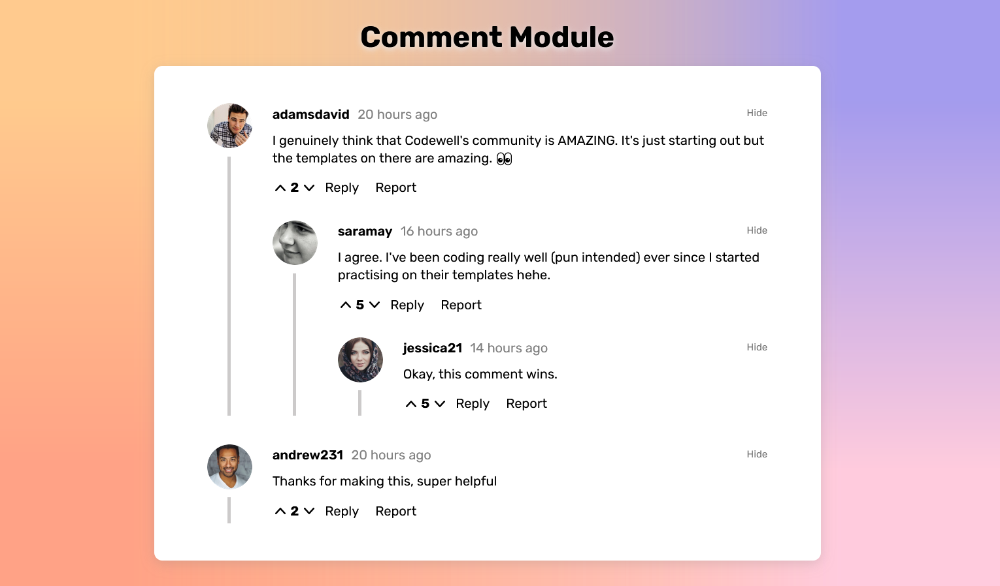

# Comment Module

[](https://app.netlify.com/sites/comment-module/deploys)

A fully responsive comment module with nested replies and collapsible comments.

[](https://comment-module.netlify.app)

Design taken from the [Comment Module Codewell challenge](https://www.codewell.cc/challenges/608bc18ee0984a001540d7a6).

This project was bootstrapped with the [Vue CLI](https://v3.vuejs.org/guide/installation.html#cli).

## Technologies Used

- [VueJS](https://v3.vuejs.org/) for frontend framework (my first foray into Vue 3).
- [GSAP](https://greensock.com/gsap/) for the expand/collapse comment animations.
- [Netlify](https://www.netlify.com/) for hosting.

## Next Features

At the moment this module is populated with hard-coded data.

I am planning to integrate it with the headless CMS [prismic](https://prismic.io/). With this I'm hoping to:
- Develop a proof-of-concept for using a headless CMS for a commenting system. Given how well suited they are for creating article-focused websites, it would be great to bring comments into a headless CMS too.
- Test out [prismic's plugin for VueJS 3](https://github.com/prismicio/prismic-vue/releases/tag/v3.0.0-alpha.0), which is still in alpha.

If you are curious to see my progress on this, it can be found in [this PR](https://github.com/aileen-r/comment-module/pull/2).

## Local Development

### Installs Node packages
```
npm install
```

### Compiles and hot-reloads for development
```
npm start
```


### Lints and fixes files
```
npm run lint
```
