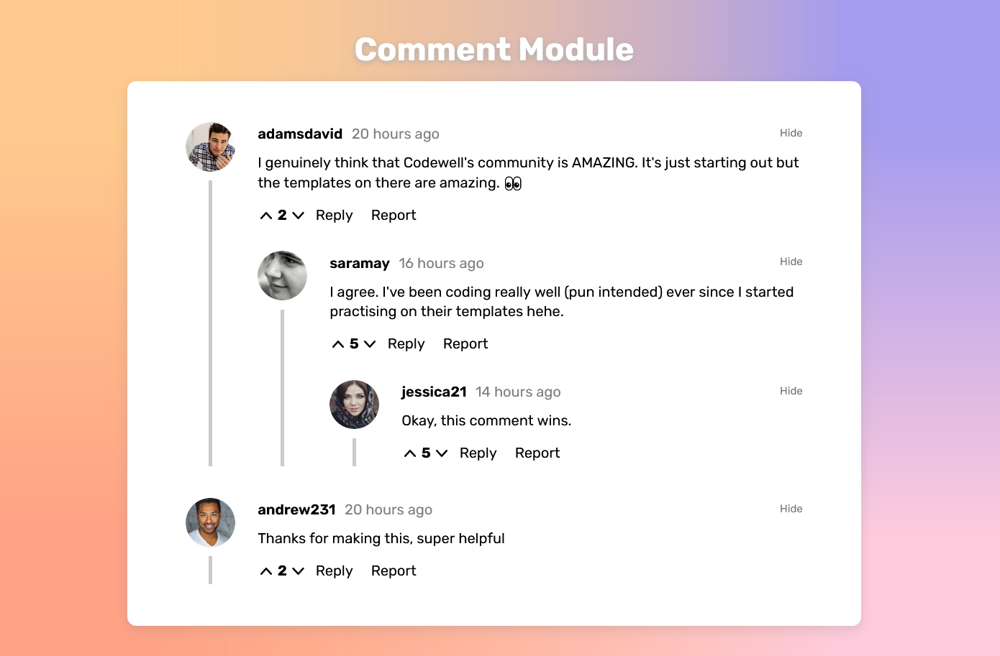

# Comment Module

[](https://app.netlify.com/sites/comment-module/deploys)

A fully responsive comment module with nested replies and collapsible comments.

[](https://comment-module.netlify.app)

Design taken from the [Comment Module Codewell challenge](https://www.codewell.cc/challenges/608bc18ee0984a001540d7a6).

This project was bootstrapped with the [Vue CLI](https://v3.vuejs.org/guide/installation.html#cli).

## Technologies Used

- [VueJS](https://v3.vuejs.org/) for frontend framework.
- [Netlify](https://www.netlify.com/) for hosting.


## Local Development

### Installs Node packages
```
npm install
```

### Compiles and hot-reloads for development
```
npm start
```


### Lints and fixes files
```
npm run lint
```
